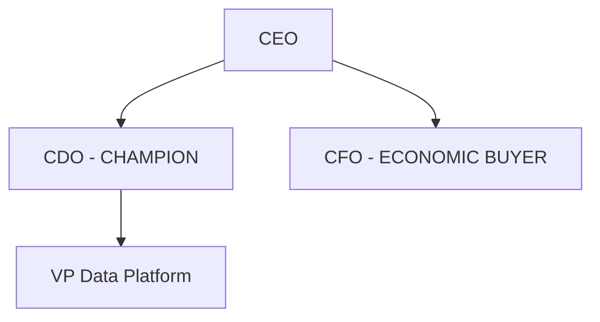

### PHASE 7: Markdown Writeup Generation (MANDATORY)

**PURPOSE**: Create a comprehensive research document in Markdown format that captures all findings in detail. This is the primary output of this skill.

#### Step 7.1: Markdown Document Structure

Generate a single Markdown file with the following structure:

```markdown
# {ACCOUNT_NAME} - FY{PLANNING_FY} Account Planning Research

**Generated**: {DATE}  
**Account Executive**: {AE_NAME}  
**Salesforce Account ID**: {SALESFORCE_ACCOUNT_ID}  
**Lookback Year**: FY{LOOKBACK_FY}  
**Planning Year**: FY{PLANNING_FY}  

---

## Table of Contents

1. [Executive Summary](#1-executive-summary)
2. [FY{LOOKBACK_FY} Performance Analysis](#2-fy-lookback-performance-analysis)
3. [Account Overview & Background](#3-account-overview--background)
4. [Stakeholder Analysis & Org Chart](#4-stakeholder-analysis--org-chart)
5. [Current Use Case Inventory](#5-current-use-case-inventory)
6. [Web Research Findings](#6-web-research-findings)
7. [Job Posting Analysis](#7-job-posting-analysis)
8. [Similar Customer Use Cases](#8-similar-customer-use-cases)
9. [White Space Analysis](#9-white-space-analysis)
10. [FY{PLANNING_FY} Strategy & Goals](#10-fy-planning-strategy--goals)
11. [Engagement Strategy](#11-engagement-strategy)
12. [Competitive Landscape](#12-competitive-landscape)
13. [Risk Assessment](#13-risk-assessment)
14. [Data Sources & Citations](#14-data-sources--citations)

---

## 1. Executive Summary

### Key Metrics

| Metric | FY{LOOKBACK_FY} Actual | FY{PLANNING_FY} Target |
|--------|------------------------|------------------------|
| Consumption | ${LOOKBACK_CONSUMPTION} | ${PLANNING_CONSUMPTION_GOAL} |
| TACV | ${LOOKBACK_TACV} | ${PLANNING_TACV_GOAL} |
| YOY Growth | {YOY_GROWTH}% | {TARGET_GROWTH}% |
| Use Cases (Production) | {PRODUCTION_COUNT} | {TARGET_USE_CASES} |

### Strategic Summary

{STRATEGIC_SUMMARY}

### SWOT Summary

| Strengths | Weaknesses |
|-----------|------------|
| {strength_1} | {weakness_1} |
| {strength_2} | {weakness_2} |

| Opportunities | Threats |
|---------------|---------|
| {opportunity_1} | {threat_1} |
| {opportunity_2} | {threat_2} |

### Traffic Light: Start / Stop / Continue

| START (New Initiatives) | STOP (Deprioritize) | CONTINUE (Maintain) |
|------------------------|---------------------|---------------------|
| {start_1} | {stop_1} | {continue_1} |
| {start_2} | {stop_2} | {continue_2} |

> **Source**: Raven ACCOUNT, SDA_USE_CASE_VIEW, A360_DAILY_ACCOUNT_PRODUCT_CATEGORY_REVENUE_VIEW

---

## 2. FY{LOOKBACK_FY} Performance Analysis

### 2.1 High-Level Commentary

{HIGH_LEVEL_COMMENTARY_ON_THE_YEAR}

### 2.2 Consumption Trend

| Month | Consumption | MoM Change |
|-------|-------------|------------|
| {month_1} | ${amount} | - |
| {month_2} | ${amount} | {change}% |
| ... | ... | ... |

> **Source**: SALES.RAVEN.A360_DAILY_ACCOUNT_PRODUCT_CATEGORY_REVENUE_VIEW

### 2.3 Product Category Breakdown

| Product Category | FY{LOOKBACK_FY} Revenue | FY{LOOKBACK_FY-1} Revenue | YOY Growth |
|-----------------|-------------------------|---------------------------|------------|
| {category} | ${amount} | ${amount} | {growth}% |

### 2.4 TACV Analysis

| Opportunity | Stage | ACV | Close Date |
|-------------|-------|-----|------------|
| {opp_name} | {stage} | ${acv} | {date} |

> **Source**: SALES.RAVEN.SDA_OPPORTUNITY_VIEW

### 2.5 Key Wins & Accomplishments

- {accomplishment_1}
- {accomplishment_2}

### 2.6 Challenges & Lessons Learned

- {challenge_1}
- {challenge_2}

---

## 3. Account Overview & Background

### Company Information

| Field | Value |
|-------|-------|
| Industry | {INDUSTRY} |
| Sub-Industry | {SUBINDUSTRY} |
| Annual Revenue | ${ANNUAL_REVENUE} |
| Employees | {NUMBER_OF_EMPLOYEES} |
| Website | {WEBSITE} |
| Account Tier | {ACCOUNT_TIER} |

> **Source**: SALES.RAVEN.ACCOUNT, D_SALESFORCE_ACCOUNT_CUSTOMERS

### Technology Stack

{TECH_STACK parsed as bullet list}

---

## 4. Stakeholder Analysis

### Key Contacts

| Name | Title | Role | Engagement Level |
|------|-------|------|------------------|
| {name} | {title} | Champion | Strong |
| {name} | {title} | Economic Buyer | Medium |

### Org Chart



> **Source**: LinkedIn Research, Snow Owl Customer_Stakeholder_Map

---

## 5. Current Use Case Inventory

### Production Use Cases

| Use Case | ACV | Workloads | Go-Live Date |
|----------|-----|-----------|--------------|
| {use_case_name} | ${acv} | {workloads} | {date} |

### Use Cases in Progress

| Use Case | Stage | ACV | Champion |
|----------|-------|-----|----------|
| {use_case_name} | {stage} | ${acv} | {champion} |

### Pain Points (from MEDDPICC)

- **{Use Case}**: {MEDDPICC_IDENTIFY_PAIN}

> **Source**: SALES.RAVEN.SDA_USE_CASE_VIEW

---

## 6. Web Research Findings

### 6.1 Annual Report / 10-K Analysis

**Source**: {10K_URL}

**Key Strategic Priorities**:
- {priority_1}
- {priority_2}

**Relevant Quotes**:
> "{quote_text}" - {source}

### 6.2 Earnings Call Analysis

**Latest Call**: {EARNINGS_DATE}

**Technology/Data Mentions**:
- {mention_1}
- {mention_2}

### 6.3 Press Releases & News

| Date | Headline | Relevance |
|------|----------|-----------|
| {date} | {headline} | {relevance} |

### 6.4 LinkedIn Research

**Key Stakeholder Profiles**:

**{Name}** - {Title}
- Background: {background}
- Recent Activity: {activity}
- Snowflake Connection: {connection}

---

## 7. Job Posting Analysis

### 7.1 Open Positions Summary

| Position | Location | Key Technologies | Posted | Snowflake Opportunity |
|----------|----------|------------------|--------|----------------------|
| {title} | {location} | {technologies} | {date} | {opportunity} |

### 7.2 Technology Stack Analysis

Technologies mentioned across all job postings:

| Technology | Frequency | Implication |
|------------|-----------|-------------|
| Snowflake | {count} | Expansion opportunity |
| Databricks | {count} | Competitive threat |
| {tech} | {count} | {implication} |

### 7.3 Strategic Direction Indicators

Based on hiring patterns, the customer appears to be investing in:

- **{area}**: {evidence}
- **{area}**: {evidence}

### 7.4 Snowflake Positioning Opportunities

| Job Requirement | Snowflake Capability | Action |
|-----------------|---------------------|--------|
| {requirement} | {capability} | {action} |

---

## 8. Similar Customer Use Cases

### 8.1 Similar Customers Analyzed

| Customer | Sub-Industry | Use Cases in Production | Total ACV |
|----------|--------------|------------------------|-----------|
| {customer_name} | {subindustry} | {count} | ${acv} |

### 8.2 Transferable Use Cases - Detailed Analysis

#### Use Case: {USE_CASE_NAME}

**Source Customer**: {SIMILAR_CUSTOMER}  
**ACV**: ${USE_CASE_ACV}  
**Status**: Production  
**Go-Live Date**: {GO_LIVE_DATE}  

**Description**:
{USE_CASE_DESCRIPTION}

**Pain Points Addressed**:
{MEDDPICC_IDENTIFY_PAIN}

**Business Metrics Achieved**:
{MEDDPICC_METRICS}

**Workloads Used**: {WORKLOADS}

**Partners Involved**: {PARTNERS}

**Transferability Assessment**:

| Criteria | Assessment |
|----------|------------|
| Problem Alignment | {HIGH/MEDIUM/LOW} - {rationale} |
| Technical Fit | {HIGH/MEDIUM/LOW} - {rationale} |
| Business Value | {HIGH/MEDIUM/LOW} - {rationale} |
| Competitive Urgency | {HIGH/MEDIUM/LOW} - {rationale} |
| Stakeholder Match | {HIGH/MEDIUM/LOW} - {rationale} |
| **RECOMMENDATION** | **{HIGH/MEDIUM/LOW}** |

### 8.3 Top Recommended Use Cases for {ACCOUNT_NAME}

1. **{Use Case 1}** - {rationale}
2. **{Use Case 2}** - {rationale}
3. **{Use Case 3}** - {rationale}

---

## 9. White Space Analysis

### Feature Adoption Status

| Category | Using | Not Using (White Space) |
|----------|-------|------------------------|
| Core Platform | {features} | {gaps} |
| AI/ML | {features} | {gaps} |
| Collaboration | {features} | {gaps} |
| Governance | {features} | {gaps} |

### White Space Opportunities

| Gap | Business Value | Recommended Action |
|-----|---------------|-------------------|
| {feature} | {value} | {action} |

> **Source**: SALES.RAVEN.A360_PRODUCT_CATEGORY_VIEW

---

## 10. FY{PLANNING_FY} Strategy & Goals

### Consumption & TACV Targets

| Metric | FY{LOOKBACK_FY} Actual | FY{PLANNING_FY} Target | Growth Required |
|--------|------------------------|------------------------|-----------------|
| Consumption | ${LOOKBACK_FY_AMOUNT} | ${PLANNING_FY_TARGET} | {growth}% |
| TACV | ${LOOKBACK_FY_AMOUNT} | ${PLANNING_FY_TARGET} | {growth}% |

### White Whale Use Case (DETAILED)

**Name**: {WHITE_WHALE_NAME}  
**Target ACV**: ${WHITE_WHALE_ACV}  

| Component | Details |
|-----------|---------|
| **WHO** (Target Stakeholder) | {stakeholder_name}, {title}, {BU} |
| **WHAT** (Use Case Details) | {use_case_description}, {technical_scope} |
| **WHY** (Business Value) | {pain_addressed}, {value_proposition} |
| **HOW** (Approach) | {implementation_approach}, {timeline} |
| **SUPPORT NEEDED** | {resources_required} |

**Champion**: {CHAMPION}  
**Economic Buyer**: {ECONOMIC_BUYER}  

### Secondary Use Cases

#### Secondary Use Case #1
- **Name**: {SECONDARY_UC_1_NAME}
- **ACV**: ${SECONDARY_UC_1_ACV}
- **Champion**: {SECONDARY_UC_1_CHAMPION}
- **Details**: {SECONDARY_UC_1_DETAILS}

#### Secondary Use Case #2
- **Name**: {SECONDARY_UC_2_NAME}
- **ACV**: ${SECONDARY_UC_2_ACV}
- **Champion**: {SECONDARY_UC_2_CHAMPION}
- **Details**: {SECONDARY_UC_2_DETAILS}

### Renewal Strategy

| Renewal | Date | ACV | Risk Level | Strategy |
|---------|------|-----|------------|----------|
| {renewal_name} | {date} | ${acv} | {risk} | {strategy} |

---

## 11. Engagement Strategy (MANDATORY SECTION)

### 11.1 PS&T Strategy

| Current PS Engagement | Recommended PS Engagement | Specific Services Needed |
|----------------------|---------------------------|-------------------------|
| {current_status} | {recommendation} | {services} |

### 11.2 Partner Strategy

| Partner | Focus Areas | Engagement Plan |
|---------|-------------|-----------------|
| {partner_1} | {focus_areas_1} | {plan_1} |
| {partner_2} | {focus_areas_2} | {plan_2} |
| {partner_3} | {focus_areas_3} | {plan_3} |

### 11.3 FMM/ABM/SDR Strategy

**Key Personas to Target:**
- {persona_1}: {title}, {BU}
- {persona_2}: {title}, {BU}

**Key BUs to Target:**
- {bu_1}: {rationale}
- {bu_2}: {rationale}

**Campaign Recommendations:**
- {campaign_1}
- {campaign_2}

### 11.4 BVE Strategy

| Current BVE Engagement | ROI Analysis Recommendation | Business Case Support |
|-----------------------|----------------------------|----------------------|
| {current_bve_status} | {roi_recommendation} | {bc_support_needed} |

### 11.5 Critical Meeting & Event Priorities

| Event | Target Timing | Attendees | Objectives |
|-------|---------------|-----------|------------|
| CEC | {q_timing} | {attendees} | {objectives} |
| Snowcamp | {q_timing} | {attendees} | {objectives} |
| QBR | {schedule} | {attendees} | {objectives} |
| {other_event} | {timing} | {attendees} | {objectives} |

---

## 12. Competitive Landscape

### Current Competitors in Account

| Competitor | Use Case | Status | Displacement Strategy |
|------------|----------|--------|----------------------|
| {competitor} | {use_case} | {status} | {strategy} |

> **Source**: SALES.RAVEN.SDA_USE_CASE_VIEW (COMPETITORS, INCUMBENT_VENDOR)

---

## 12. Risk Assessment

### Account Risks

| Risk | Likelihood | Impact | Mitigation |
|------|------------|--------|------------|
| {risk} | {HIGH/MED/LOW} | {HIGH/MED/LOW} | {mitigation} |

---

## 13. Data Sources & Citations

### Raven Queries Executed

| Query | Table | Records |
|-------|-------|---------|
| {description} | {table} | {count} |

### Web Sources

| Source | URL | Accessed |
|--------|-----|----------|
| {title} | {url} | {date} |

### LinkedIn Profiles Researched

- {name} - {title}

### Job Postings Analyzed

- {title} - {url}

---

*Generated by Executive Account Planning Skill v2026-02-19*
```

#### Step 7.2: Save Markdown File

```python
from datetime import datetime

# Generate filename using PLANNING_FY variable
safe_name = ACCOUNT_NAME.replace(' ', '_').replace('+', '').replace('&', 'and')
safe_name = ''.join(c for c in safe_name if c.isalnum() or c == '_')
md_filename = f"{safe_name}_FY{PLANNING_FY}_Account_Plan_Research_{datetime.now().strftime('%Y%m%d')}.md"
md_output_path = os.path.join(OUTPUT_DIR, md_filename)

# Write markdown file
with open(md_output_path, 'w', encoding='utf-8') as f:
    f.write(markdown_content)

print(f"Markdown writeup saved: {md_output_path}")
```

#### Step 7.3: Markdown Best Practices

- Use **tables** for structured data (metrics, use cases, stakeholders)
- Use **blockquotes** (`>`) for source citations after each section
- Use **Mermaid code blocks** for diagrams (org charts, architecture)
- Use **bold** for emphasis on key findings
- Include **links** to source URLs where available
- Keep sections clearly delineated with `---` horizontal rules

---
