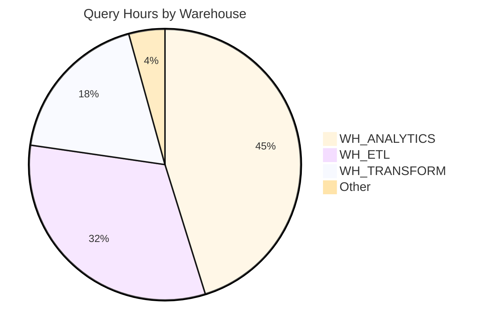
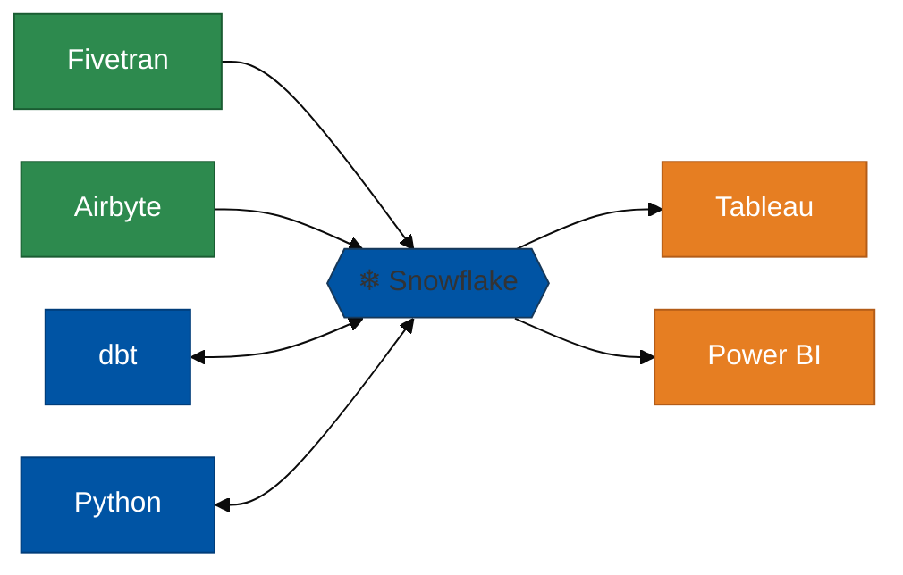

# Snowflake User Analysis

Deep-dive profiling of a specific user's query activity on a Snowflake account. Supports two data sources:
- **Customer accounts** via Snowhouse (for SE/AE analysis of customer workloads)
- **Local accounts** via `SNOWFLAKE.ACCOUNT_USAGE` views (for analyzing your own Snowflake account)

Produces a comprehensive markdown report covering business use cases, compute patterns, external tools and connectors, statement types per tool, pipeline inventory, error analysis, and optimization opportunities. Reports include Mermaid diagrams (data flow, warehouse distribution) and Chart.js charts (hourly activity, weekly trends) that render natively in PDF exports.

## Prerequisites

**Customer mode (Snowhouse):**
- Active Snowhouse connection (e.g., `SNOWHOUSE_SE`)
- Customer name or Snowflake account ID

**Local mode (Account Usage):**
- Active Snowflake connection with access to `SNOWFLAKE.ACCOUNT_USAGE.QUERY_HISTORY`
- ACCOUNTADMIN or a role with imported privileges on the SNOWFLAKE database

## Workflow

### Step 0: Detect Intent & Entry Point

Determine which entry point the user needs:

| Intent | Trigger Examples | Route |
|--------|-----------------|-------|
| **Top Users** | "top 10 users at customer X", "who uses the most credits at X", "show me top users by credits" | → Step 1A: Top Users by Credits |
| **Specific User Profile** | "profile user X", "analyze user X on account Y", "user activity for X" | → Step 1B: Resolve Account & User |
| **Local User Analysis** | "analyze my account", "profile user X on my account", "local user analysis" | → Step 1C: Local Account Mode |

If intent is ambiguous, ask:
```
What would you like to do?
1. Show top users by credit usage at a customer
2. Deep-dive profile of a specific user on a customer account
3. Analyze a user on your own (local) Snowflake account
```

### Step 1A: Top Users by Credits (Customer Account)

**Goal:** Identify the top N users by estimated credit consumption on a customer account.

1. **Get customer name** from user (e.g., "DoorDash", "Instacart")
2. **Resolve account** — run account lookup (see Step 1B substep 2)
3. **Run top users query** against the resolved account:

```sql
WITH user_type AS (
    SELECT key::INT AS id, value::STRING AS user_type_name
    FROM TABLE(FLATTEN(input => SELECT parse_json(system$dump_enum('UserType'))))
),
user_info AS (
    SELECT u.name, ut.user_type_name AS user_type
    FROM snowhouse_import.{DEPLOYMENT}.user_etl_v u
    LEFT JOIN user_type ut ON u.type = ut.id
    WHERE u.account_id = {ACCOUNT_ID} AND u.temp_id = 0
),
user_wh_time AS (
    SELECT
        user_name,
        warehouse_name,
        COUNT(*) AS query_count,
        SUM(
            LEAST(COALESCE(dpo:"JobDPO:stats":endTime::INT, 0), 4102444800000)
            - dpo:"JobDPO:primary":createdOn::INT
        ) AS total_elapsed_ms
    FROM snowhouse_import.{DEPLOYMENT}.job_raw_v
    WHERE account_id = {ACCOUNT_ID}
      AND created_on >= DATEADD(day, -{DAYS_BACK}, CURRENT_DATE())
      AND child_job_type != 4
      AND bitand(flags, 2080) != 2080
      AND bitand(flags, 1073741824) != 1073741824
      AND bitand(flags, 288230376151711744) = 0
      AND current_state_id != 25
      AND warehouse_name IS NOT NULL
    GROUP BY user_name, warehouse_name
),
wh_total_time AS (
    SELECT warehouse_name, SUM(total_elapsed_ms) AS wh_total_ms
    FROM user_wh_time
    GROUP BY warehouse_name
),
wh_credits AS (
    SELECT
        entity_name AS warehouse_name,
        SUM(server_count * server_type_base_credits
            + gs_server_count * server_type_base_credits) AS total_credits
    FROM snowhouse_import.{DEPLOYMENT}.METERING_METRICS_ETL_V
    WHERE account_id = {ACCOUNT_ID}
      AND start_time >= DATEADD(day, -{DAYS_BACK}, CURRENT_DATE())
      AND entity_name IS NOT NULL
      AND entity_id != 0
    GROUP BY entity_name
),
ranked AS (
    SELECT
        u.user_name,
        SUM(u.query_count) AS total_queries,
        ROUND(SUM(u.total_elapsed_ms) / 3600000.0, 1) AS query_hours,
        ROUND(SUM(
            CASE WHEN wt.wh_total_ms > 0
                 THEN (u.total_elapsed_ms / wt.wh_total_ms) * wc.total_credits
                 ELSE 0
            END
        ), 1) AS estimated_credits,
        COUNT(DISTINCT u.warehouse_name) AS warehouses_used,
        COALESCE(ui.user_type, 'UNKNOWN') AS user_type
    FROM user_wh_time u
    JOIN wh_total_time wt ON u.warehouse_name = wt.warehouse_name
    LEFT JOIN wh_credits wc ON u.warehouse_name = wc.warehouse_name
    LEFT JOIN user_info ui ON u.user_name = ui.name
    GROUP BY u.user_name, ui.user_type
)
SELECT * FROM ranked
ORDER BY estimated_credits DESC
```

The `user_type` column comes from Snowflake's `UserType` enum via `user_etl_v.type`:

| ID | Type | Classification |
|---|---|---|
| 1 | PERSON | Human user |
| 2 | SERVICE | Service account |
| 3 | LEGACY_SERVICE | Service account |
| 4 | SNOWFLAKE_SERVICE | Service account (internal) |
| 5 | SNOWFLAKE_OAUTH | Service account (OAuth) |
| 6 | POSTGRES_SERVICE | Service account (Postgres) |

Default `TOP_N` = 10, `DAYS_BACK` = 30.

4. **Present results as two separate tables** — split by `user_type`. PERSON = human; all others (SERVICE, LEGACY_SERVICE, SNOWFLAKE_SERVICE, SNOWFLAKE_OAUTH, POSTGRES_SERVICE, UNKNOWN) = service accounts. Show the top `{TOP_N}` of each category:

   **Top {TOP_N} Human Users (PERSON) by Estimated Credits:**

   | Rank | User | Total Queries | Query Hours | Est. Credits | Warehouses |
   |-----:|:-----|-------------:|------------:|-----------:|-----------:|

   **Top {TOP_N} Service Accounts by Estimated Credits:**

   | Rank | User | Type | Total Queries | Query Hours | Est. Credits | Warehouses |
   |-----:|:-----|:-----|-------------:|------------:|-----------:|-----------:|

   Include the `user_type` column in the service accounts table to distinguish SERVICE vs LEGACY_SERVICE vs others.

5. **Ask user** if they want to deep-dive into a specific user → proceed to Step 2 with selected user

### Step 1B: Resolve Account & User (Customer Account via Snowhouse)

**Goal:** Resolve the customer name and/or username to concrete account parameters.

1. **Get user name** to profile (if provided)
2. **Resolve Snowflake account** — if user provides a customer name but not the account ID/deployment:

   **Search SUBSCRIPTIONS_DT for the customer:**
   ```sql
   SELECT DISTINCT
       SFDC_CUST_NAME AS CUSTOMER_NAME,
       SF_ACCT_ID,
       SF_ACCT_NAME || ' (' || IFNULL(SF_ACCT_ALIAS,'NO ALIAS') || ')' AS SF_ACCT_DISPLAY,
       SF_ACCT_NAME AS SF_ACCOUNT_NAME,
       SF_SERVICE AS EDITION,
       SF_AGREEMENT_TYPE,
       SF_CLOUD || ' → ' || PROVIDER_REGION || ' → ' || SF_DEPLOYMENT AS CLOUD_DEPLOYMENT,
       SF_DEPLOYMENT,
       L30_CREDITS,
       SUB_START_DATE,
       SUB_END_DATE
   FROM TEMP.VSHIV.SUBSCRIPTIONS_DT
   WHERE UPPER(SFDC_CUST_NAME) ILIKE '%{CUSTOMER_NAME}%'
   ORDER BY L30_CREDITS DESC NULLS LAST
   ```

   - If multiple accounts found, present the list and ask user to select one
   - Extract `SF_ACCT_ID` (numeric account ID) and `SF_DEPLOYMENT` from the selected row

3. **Set variables:**
   - `USER_NAME` — user name pattern for ILIKE matching (e.g., `%MAXWELL%KAISER%`)
   - `ACCOUNT_ID` — numeric SF_ACCT_ID from SUBSCRIPTIONS_DT
   - `DEPLOYMENT` — SF_DEPLOYMENT from SUBSCRIPTIONS_DT
   - `CUSTOMER_NAME` — SFDC_CUST_NAME for report header and filename (Salesforce account name)
   - `SF_ACCT_NAME` — SF_ACCT_NAME from SUBSCRIPTIONS_DT (Snowflake account name, used in filename)
   - `DAYS_BACK` — lookback days (default 91)
   - `CONNECTION` — Snowhouse connection to use

4. **Proceed to Step 2** (data gathering)

### Step 1C: Local Account Mode (ACCOUNT_USAGE)

**Goal:** Profile a user on the local Snowflake account using ACCOUNT_USAGE views.

1. **Get user name** to profile (or ask to list top users first)
2. **Get connection name** — the Snowflake connection with ACCOUNT_USAGE access
3. **Set `MODE = LOCAL`** — this changes all subsequent queries to use ACCOUNT_USAGE views instead of Snowhouse

**If user wants top users first:**
```sql
SELECT
    qh.user_name,
    COUNT(*) AS total_queries,
    ROUND(SUM(qh.total_elapsed_time) / 3600000.0, 1) AS query_hours,
    ROUND(SUM(qh.credits_used_cloud_services), 2) AS cloud_service_credits,
    COUNT(DISTINCT qh.warehouse_name) AS warehouses_used,
    COUNT(DISTINCT qh.database_name) AS databases_used,
    COALESCE(u.type, 'UNKNOWN') AS user_type
FROM SNOWFLAKE.ACCOUNT_USAGE.QUERY_HISTORY qh
LEFT JOIN SNOWFLAKE.ACCOUNT_USAGE.USERS u ON qh.user_name = u.name AND u.deleted_on IS NULL
WHERE qh.start_time >= DATEADD(day, -{DAYS_BACK}, CURRENT_DATE())
  AND qh.execution_status != 'RUNNING'
GROUP BY qh.user_name, u.type
ORDER BY query_hours DESC
```

Present results as two separate tables (same format as Step 1A): **Top Human Users** (where `user_type` = `'PERSON'`) and **Top Service Accounts** (all other types), showing `{TOP_N}` of each.

4. **Capture local account name** for the report filename:
   ```sql
   SELECT CURRENT_ACCOUNT_NAME() AS ACCOUNT_NAME
   ```

5. **Set variables:**
   - `USER_NAME` — exact user name
   - `DAYS_BACK` — lookback days (default 91)
   - `MODE` = `LOCAL`
   - `SF_ACCT_NAME` — result of `CURRENT_ACCOUNT_NAME()` (Snowflake account name, used in filename)
   - `CUSTOMER_NAME` — set to `"Local"` (no Salesforce account in local mode)
6. **Proceed to Step 2** (data gathering — local variant)

### Step 2: Run Data-Gathering Queries (Parallel)

**Mode determines the data source:**
- **Customer mode (default):** `snowhouse_import.{DEPLOYMENT}.job_raw_v` via Snowhouse connection
- **Local mode (`MODE = LOCAL`):** `SNOWFLAKE.ACCOUNT_USAGE.QUERY_HISTORY` via local Snowflake connection

#### Customer Mode Base Filter

All Snowhouse queries share this base filter:

```sql
WHERE account_id = {ACCOUNT_ID}
  AND user_name ILIKE '{USER_NAME}'
  AND created_on >= DATEADD(day, -{DAYS_BACK}, CURRENT_DATE())
  AND child_job_type != 4
  AND bitand(flags, 2080) != 2080
  AND bitand(flags, 1073741824) != 1073741824
  AND bitand(flags, 288230376151711744) = 0
  AND current_state_id != 25
```

#### Local Mode Base Filter

All ACCOUNT_USAGE queries share this base filter:

```sql
WHERE user_name = '{USER_NAME}'
  AND start_time >= DATEADD(day, -{DAYS_BACK}, CURRENT_DATE())
  AND execution_status != 'RUNNING'
```

#### Query 1: Activity Overview

**Customer mode:**
```sql
SELECT
    COUNT(*) AS total_queries,
    COUNT(DISTINCT DATE_TRUNC('day', created_on)::DATE) AS active_days,
    MIN(created_on) AS first_query,
    MAX(created_on) AS last_query,
    COUNT(DISTINCT warehouse_name) AS warehouses_used,
    COUNT(DISTINCT database_name) AS databases_used,
    COUNT(DISTINCT role_name) AS roles_used
FROM snowhouse_import.{DEPLOYMENT}.job_raw_v
{BASE_FILTER}
```

**Local mode:**
```sql
SELECT
    COUNT(*) AS total_queries,
    COUNT(DISTINCT DATE_TRUNC('day', start_time)::DATE) AS active_days,
    MIN(start_time) AS first_query,
    MAX(start_time) AS last_query,
    COUNT(DISTINCT warehouse_name) AS warehouses_used,
    COUNT(DISTINCT database_name) AS databases_used,
    COUNT(DISTINCT role_name) AS roles_used
FROM SNOWFLAKE.ACCOUNT_USAGE.QUERY_HISTORY
{BASE_FILTER}
```

#### Query 2: Dimension Breakdown (warehouses, databases, roles)

**Customer mode:** Use `snowhouse_import.{DEPLOYMENT}.job_raw_v` with `{BASE_FILTER}`.
**Local mode:** Use `SNOWFLAKE.ACCOUNT_USAGE.QUERY_HISTORY` with `{BASE_FILTER}`.

```sql
SELECT 'warehouse' AS dim, warehouse_name AS val, COUNT(*) AS cnt
FROM {SOURCE_TABLE} {BASE_FILTER}
GROUP BY warehouse_name
UNION ALL
SELECT 'database', database_name, COUNT(*)
FROM {SOURCE_TABLE} {BASE_FILTER}
GROUP BY database_name
UNION ALL
SELECT 'role', role_name, COUNT(*)
FROM {SOURCE_TABLE} {BASE_FILTER}
GROUP BY role_name
ORDER BY dim, cnt DESC
```

#### Query 3: Warehouse Usage & Compute

**Customer mode:** Parse `dpo` JSON to extract elapsed time and execution status per warehouse:
- `total_elapsed_time_ms = LEAST(COALESCE(dpo:"JobDPO:stats":endTime::INT, 0), 4102444800000) - dpo:"JobDPO:primary":createdOn::INT`
- `execution_status = DECODE(COALESCE(strip_null_value(dpo:"JobDPO:stats":currentStateId), strip_null_value(dpo:"JobDPO:primary":currentStateId))::INT, 15, 'FAIL', 16, 'INCIDENT', 17, 'SUCCESS')`

Group by warehouse: query_hours, total_queries, failed_queries, avg_elapsed_sec, max_elapsed_sec.

**Local mode:**
```sql
SELECT
    warehouse_name,
    ROUND(SUM(total_elapsed_time) / 3600000.0, 2) AS query_hours,
    COUNT(*) AS total_queries,
    SUM(CASE WHEN execution_status = 'FAIL' THEN 1 ELSE 0 END) AS failed_queries,
    ROUND(AVG(total_elapsed_time) / 1000.0, 1) AS avg_elapsed_sec,
    ROUND(MAX(total_elapsed_time) / 1000.0, 1) AS max_elapsed_sec
FROM SNOWFLAKE.ACCOUNT_USAGE.QUERY_HISTORY
{BASE_FILTER}
  AND warehouse_name IS NOT NULL
GROUP BY warehouse_name
ORDER BY query_hours DESC
```

#### Query 4: Time-of-Day Pattern

**Customer mode:** Use `created_on` from `job_raw_v`.
**Local mode:** Use `start_time` from `QUERY_HISTORY`.

```sql
-- Customer mode uses created_on; Local mode uses start_time
SELECT
    HOUR(CONVERT_TIMEZONE('America/Los_Angeles', {TIME_COL})) AS hour_pst,
    COUNT(*) AS query_count,
    ROUND(AVG({ELAPSED_COL}) / 1000.0, 1) AS avg_elapsed_sec,
    ROUND(MAX({ELAPSED_COL}) / 1000.0, 1) AS max_elapsed_sec
FROM {SOURCE_TABLE} {BASE_FILTER}
GROUP BY hour_pst ORDER BY hour_pst
```
- Customer: `{TIME_COL}` = `created_on`, `{ELAPSED_COL}` = derived `total_elapsed_time_ms`
- Local: `{TIME_COL}` = `start_time`, `{ELAPSED_COL}` = `total_elapsed_time`

#### Query 5: Day-of-Week Pattern
```sql
SELECT
    DAYNAME(CONVERT_TIMEZONE('America/Los_Angeles', {TIME_COL})) AS day_of_week,
    DAYOFWEEK(CONVERT_TIMEZONE('America/Los_Angeles', {TIME_COL})) AS dow_num,
    COUNT(*) AS query_count
FROM {SOURCE_TABLE} {BASE_FILTER}
GROUP BY day_of_week, dow_num ORDER BY dow_num
```

#### Query 6: Query Type Breakdown

**Customer mode:** Join with `statement_type` enum:
```sql
WITH statement_type AS (
    SELECT key::INT AS id, value::STRING AS statement_type
    FROM TABLE(FLATTEN(input => SELECT parse_json(system$dump_enum('StatementType'))))
)
```
Group by query_type + warehouse_name: count, avg_elapsed_sec. ORDER BY count DESC LIMIT 30.

**Local mode:** `query_type` is already a column in QUERY_HISTORY:
```sql
SELECT
    query_type,
    warehouse_name,
    COUNT(*) AS cnt,
    ROUND(AVG(total_elapsed_time) / 1000.0, 1) AS avg_elapsed_sec
FROM SNOWFLAKE.ACCOUNT_USAGE.QUERY_HISTORY
{BASE_FILTER}
GROUP BY query_type, warehouse_name
ORDER BY cnt DESC
LIMIT 30
```

#### Query 7: Success/Failure Summary

**Customer mode:** Group by execution_status (SUCCESS/FAIL/INCIDENT), return counts.
**Local mode:**
```sql
SELECT execution_status, COUNT(*) AS cnt
FROM SNOWFLAKE.ACCOUNT_USAGE.QUERY_HISTORY
{BASE_FILTER}
GROUP BY execution_status
ORDER BY cnt DESC
```

#### Query 8: Error Code Breakdown

**Customer mode:**
```sql
SELECT error_code, COUNT(*) AS cnt
WHERE error_code IS NOT NULL AND error_code != 0
GROUP BY error_code ORDER BY cnt DESC LIMIT 15
```

**Local mode:**
```sql
SELECT error_code, error_message, COUNT(*) AS cnt
FROM SNOWFLAKE.ACCOUNT_USAGE.QUERY_HISTORY
{BASE_FILTER}
  AND error_code IS NOT NULL AND error_code != 0
GROUP BY error_code, error_message
ORDER BY cnt DESC
LIMIT 15
```

#### Query 14: External Tools & Connectors

Identifies which external tools/clients the user connects through, based on the `client_environment:APPLICATION` field in session metadata.

**Customer mode:**
```sql
WITH statement_type AS (
    SELECT key::INT AS id, value::STRING AS statement_type
    FROM TABLE(FLATTEN(input => SELECT parse_json(system$dump_enum('StatementType'))))
),
user_sessions AS (
    SELECT
        s.id AS session_id,
        COALESCE(
            TEMP.VSHIV.GET_TOOL(UPPER(COALESCE(
                s.client_environment:APPLICATION::VARCHAR,
                s.client_environment:APPLICATION
            ))),
            'UNKNOWN'
        ) AS tool_name,
        s.client_environment:APPLICATION::STRING AS raw_application
    FROM snowhouse_import.{DEPLOYMENT}.session_etl_v s
    WHERE s.account_id = {ACCOUNT_ID}
      AND s.access_time >= DATEADD(day, -{DAYS_BACK}, CURRENT_DATE())
      AND EXISTS (
          SELECT 1 FROM snowhouse_import.{DEPLOYMENT}.job_raw_v j
          WHERE j.account_id = {ACCOUNT_ID}
            AND j.session_id = s.id
            AND j.user_name ILIKE '{USER_NAME}'
            AND j.created_on >= DATEADD(day, -{DAYS_BACK}, CURRENT_DATE())
      )
),
tool_jobs AS (
    SELECT
        us.tool_name,
        us.raw_application,
        COALESCE(st.statement_type, 'UNKNOWN') AS statement_type,
        CASE
            WHEN st.statement_type IN ('INSERT','COPY','MERGE','UPDATE','DELETE',
                 'CREATE_TABLE_AS_SELECT','PUT_FILES','INSERT_MULTI_TABLE') THEN 'INBOUND'
            WHEN st.statement_type IN ('SELECT','SHOW','DESCRIBE','GET_FILES',
                 'UNLOAD','PARTITIONED_UNLOAD') THEN 'OUTBOUND'
            ELSE 'OTHER'
        END AS data_flow_direction,
        COUNT(*) AS query_count,
        ROUND(SUM(
            LEAST(COALESCE(j.dpo:"JobDPO:stats":endTime::INT, 0), 4102444800000)
            - j.dpo:"JobDPO:primary":createdOn::INT
        ) / 3600000.0, 2) AS query_hours
    FROM snowhouse_import.{DEPLOYMENT}.job_raw_v j
    INNER JOIN user_sessions us ON j.session_id = us.session_id
    LEFT JOIN statement_type st ON COALESCE(j.statement_properties, 0) = st.id
    WHERE j.account_id = {ACCOUNT_ID}
      AND j.user_name ILIKE '{USER_NAME}'
      AND j.created_on >= DATEADD(day, -{DAYS_BACK}, CURRENT_DATE())
      AND j.child_job_type != 4
      AND bitand(j.flags, 2080) != 2080
      AND bitand(j.flags, 1073741824) != 1073741824
      AND bitand(j.flags, 288230376151711744) = 0
      AND j.current_state_id != 25
    GROUP BY us.tool_name, us.raw_application, st.statement_type, data_flow_direction
)
SELECT
    tool_name,
    raw_application,
    SUM(query_count) AS total_queries,
    ROUND(SUM(query_hours), 2) AS total_query_hours,
    SUM(CASE WHEN data_flow_direction = 'INBOUND' THEN query_count ELSE 0 END) AS inbound_queries,
    SUM(CASE WHEN data_flow_direction = 'OUTBOUND' THEN query_count ELSE 0 END) AS outbound_queries,
    SUM(CASE WHEN data_flow_direction = 'OTHER' THEN query_count ELSE 0 END) AS other_queries,
    LISTAGG(DISTINCT
        CASE WHEN data_flow_direction IN ('INBOUND','OUTBOUND') THEN statement_type END,
        ', '
    ) WITHIN GROUP (ORDER BY statement_type) AS statement_types_used
FROM tool_jobs
GROUP BY tool_name, raw_application
ORDER BY total_queries DESC
```

**Local mode:** Uses `SNOWFLAKE.ACCOUNT_USAGE.SESSIONS` joined with `QUERY_HISTORY`:
```sql
WITH user_sessions AS (
    SELECT
        s.session_id,
        COALESCE(s.client_application_id, 'UNKNOWN') AS tool_name,
        s.client_application_id AS raw_application
    FROM SNOWFLAKE.ACCOUNT_USAGE.SESSIONS s
    WHERE s.user_name = '{USER_NAME}'
      AND s.created_on >= DATEADD(day, -{DAYS_BACK}, CURRENT_DATE())
)
SELECT
    us.tool_name,
    us.raw_application,
    COUNT(*) AS total_queries,
    ROUND(SUM(qh.total_elapsed_time) / 3600000.0, 2) AS total_query_hours,
    SUM(CASE WHEN qh.query_type IN ('INSERT','COPY','MERGE','UPDATE','DELETE',
         'CREATE_TABLE_AS_SELECT','PUT_FILES') THEN 1 ELSE 0 END) AS inbound_queries,
    SUM(CASE WHEN qh.query_type IN ('SELECT','SHOW','DESCRIBE','GET_FILES',
         'UNLOAD') THEN 1 ELSE 0 END) AS outbound_queries,
    SUM(CASE WHEN qh.query_type NOT IN ('INSERT','COPY','MERGE','UPDATE','DELETE',
         'CREATE_TABLE_AS_SELECT','PUT_FILES','SELECT','SHOW','DESCRIBE',
         'GET_FILES','UNLOAD') THEN 1 ELSE 0 END) AS other_queries,
    LISTAGG(DISTINCT qh.query_type, ', ')
        WITHIN GROUP (ORDER BY qh.query_type) AS statement_types_used
FROM SNOWFLAKE.ACCOUNT_USAGE.QUERY_HISTORY qh
INNER JOIN user_sessions us ON qh.session_id = us.session_id
WHERE qh.user_name = '{USER_NAME}'
  AND qh.start_time >= DATEADD(day, -{DAYS_BACK}, CURRENT_DATE())
  AND qh.execution_status != 'RUNNING'
GROUP BY us.tool_name, us.raw_application
ORDER BY total_queries DESC
```

**Note:** The `TEMP.VSHIV.GET_TOOL()` UDF normalizes raw application strings (e.g., `"Python 3.11.0"` → `PYTHON`, `"Tableau/2024.1"` → `TABLEAU`, `"dbt/1.7.0"` → `DBT`). In local mode, `client_application_id` from `SNOWFLAKE.ACCOUNT_USAGE.SESSIONS` provides a similar identifier but may not be normalized — present the raw value and infer the tool category in the report.

#### Query 15: Statement Types by Tool (Detailed Breakdown)

Provides a detailed per-tool, per-statement-type matrix showing exactly what each tool does against Snowflake.

**Customer mode:**
```sql
WITH statement_type AS (
    SELECT key::INT AS id, value::STRING AS statement_type
    FROM TABLE(FLATTEN(input => SELECT parse_json(system$dump_enum('StatementType'))))
),
user_sessions AS (
    SELECT s.id AS session_id,
        COALESCE(
            TEMP.VSHIV.GET_TOOL(UPPER(COALESCE(
                s.client_environment:APPLICATION::VARCHAR,
                s.client_environment:APPLICATION
            ))),
            'UNKNOWN'
        ) AS tool_name
    FROM snowhouse_import.{DEPLOYMENT}.session_etl_v s
    WHERE s.account_id = {ACCOUNT_ID}
      AND s.access_time >= DATEADD(day, -{DAYS_BACK}, CURRENT_DATE())
      AND EXISTS (
          SELECT 1 FROM snowhouse_import.{DEPLOYMENT}.job_raw_v j
          WHERE j.account_id = {ACCOUNT_ID}
            AND j.session_id = s.id
            AND j.user_name ILIKE '{USER_NAME}'
            AND j.created_on >= DATEADD(day, -{DAYS_BACK}, CURRENT_DATE())
      )
)
SELECT
    us.tool_name,
    COALESCE(st.statement_type, 'UNKNOWN') AS statement_type,
    COUNT(*) AS query_count,
    ROUND(AVG(
        LEAST(COALESCE(j.dpo:"JobDPO:stats":endTime::INT, 0), 4102444800000)
        - j.dpo:"JobDPO:primary":createdOn::INT
    ) / 1000.0, 1) AS avg_elapsed_sec,
    ROUND(SUM(
        LEAST(COALESCE(j.dpo:"JobDPO:stats":endTime::INT, 0), 4102444800000)
        - j.dpo:"JobDPO:primary":createdOn::INT
    ) / 3600000.0, 2) AS query_hours
FROM snowhouse_import.{DEPLOYMENT}.job_raw_v j
INNER JOIN user_sessions us ON j.session_id = us.session_id
LEFT JOIN statement_type st ON COALESCE(j.statement_properties, 0) = st.id
WHERE j.account_id = {ACCOUNT_ID}
  AND j.user_name ILIKE '{USER_NAME}'
  AND j.created_on >= DATEADD(day, -{DAYS_BACK}, CURRENT_DATE())
  AND j.child_job_type != 4
  AND bitand(j.flags, 2080) != 2080
  AND bitand(j.flags, 1073741824) != 1073741824
  AND bitand(j.flags, 288230376151711744) = 0
  AND j.current_state_id != 25
GROUP BY us.tool_name, st.statement_type
ORDER BY us.tool_name, query_count DESC
```

**Local mode:**
```sql
WITH user_sessions AS (
    SELECT s.session_id,
        COALESCE(s.client_application_id, 'UNKNOWN') AS tool_name
    FROM SNOWFLAKE.ACCOUNT_USAGE.SESSIONS s
    WHERE s.user_name = '{USER_NAME}'
      AND s.created_on >= DATEADD(day, -{DAYS_BACK}, CURRENT_DATE())
)
SELECT
    us.tool_name,
    qh.query_type AS statement_type,
    COUNT(*) AS query_count,
    ROUND(AVG(qh.total_elapsed_time) / 1000.0, 1) AS avg_elapsed_sec,
    ROUND(SUM(qh.total_elapsed_time) / 3600000.0, 2) AS query_hours
FROM SNOWFLAKE.ACCOUNT_USAGE.QUERY_HISTORY qh
INNER JOIN user_sessions us ON qh.session_id = us.session_id
WHERE qh.user_name = '{USER_NAME}'
  AND qh.start_time >= DATEADD(day, -{DAYS_BACK}, CURRENT_DATE())
  AND qh.execution_status != 'RUNNING'
GROUP BY us.tool_name, qh.query_type
ORDER BY us.tool_name, query_count DESC
```

### Step 3: Run Business-Context Queries (Parallel)

These require query text analysis and are heavier — run after Step 2 confirms data exists.

**Customer mode:** Uses DPO JSON parsing from `job_raw_v`. Query text extracted via:
```sql
IFF(bitand(flags, 549755813888) = 0,
    IFF(bitand(flags, 34359738368) = 0,
        strip_null_value(dpo:"JobDPO:description":description)::STRING, ''),
    '<redacted>') AS query_text
```

**Local mode:** `query_text` is directly available in `SNOWFLAKE.ACCOUNT_USAGE.QUERY_HISTORY`.

#### Query 9: CTAS Target Tables
Extract table names from CTAS query text:
```sql
SELECT
    REGEXP_SUBSTR(query_text, 'create or replace table\\s+(\\S+)', 1, 1, 'i', 1) AS target_table,
    COUNT(*) AS rebuild_count,
    AVG({ELAPSED_COL}) / 1000.0 AS avg_elapsed_sec,
    MAX({ELAPSED_COL}) / 1000.0 AS max_elapsed_sec
FROM {SOURCE_TABLE} {BASE_FILTER}
  AND query_text ILIKE 'create or replace table%'
GROUP BY target_table ORDER BY rebuild_count DESC LIMIT 25
```

#### Query 10: GRANT Targets
Extract GRANT statements to understand data publishing pattern:
```sql
SELECT LEFT(query_text, 300) AS grant_text, COUNT(*) AS cnt
FROM {SOURCE_TABLE} {BASE_FILTER}
  AND query_type = 'GRANT' AND query_text IS NOT NULL
GROUP BY grant_text ORDER BY cnt DESC LIMIT 25
```

#### Query 11: Top Query Text Samples (CTAS/INSERT/SELECT/COPY)
Get the 80 longest-running non-metadata queries with first 500 chars of query text. This is the primary source for business use case analysis.

**Local mode:** Use `LEFT(query_text, 500)` directly from QUERY_HISTORY, ordered by `total_elapsed_time DESC`.

#### Query 12: Top SELECT Query Samples
Get 30 longest-running SELECT queries with first 400 chars. Supplements Query 11 for ad-hoc analysis patterns.

#### Query 13: Weekly Trajectory
```sql
SELECT
    DATE_TRUNC('week', CONVERT_TIMEZONE('America/Los_Angeles', {TIME_COL}))::DATE AS week_start,
    COUNT(*) AS total_queries,
    SUM(CASE WHEN query_type = 'SELECT' THEN 1 ELSE 0 END) AS selects,
    SUM(CASE WHEN query_type IN ('CREATE_TABLE_AS_SELECT', 'CTAS') THEN 1 ELSE 0 END) AS ctas,
    SUM(CASE WHEN query_type = 'INSERT' THEN 1 ELSE 0 END) AS inserts,
    SUM(CASE WHEN query_type = 'GRANT' THEN 1 ELSE 0 END) AS grants,
    ROUND(SUM({ELAPSED_COL}) / 3600000.0, 1) AS query_hours
FROM {SOURCE_TABLE} {BASE_FILTER}
GROUP BY week_start ORDER BY week_start DESC
```

### Step 4: Analyze & Write Report

Using data from Steps 2–3, produce a **well-formatted markdown report**. Use consistent markdown table alignment, horizontal rules (`---`) between major sections, and proper header hierarchy throughout.

**Diagrams & Charts Reference:**

The report template includes Mermaid diagrams and Chart.js charts that render in the PDF via CDN (see Step 6). Follow these rules when generating them:

| Element | Library | Rules |
|:--------|:--------|:------|
| Data Flow Diagram | Mermaid | Use `flowchart LR` for horizontal layout. Color-code: green (`#2d8a4e`) = INBOUND, blue (`#0054a4`) = MIXED/TRANSFORM, orange (`#e67e22`) = OUTBOUND. Include `%%{init}%%` directive with `fontSize: '16px'`. Only show tools that actually appear in query data. |
| Warehouse Pie Chart | Mermaid | Use `pie title ...` syntax. Group warehouses with <1% share into "Other". Round values to 1 decimal. Include `%%{init}%%` with `fontSize: '16px'`. |
| Hourly Bar Chart | Chart.js | Use `<canvas>` with `width="700" height="260"` and `responsive: false`. Populate the `data` array with 24 values (hours 0–23) from Query 7. Use `#0054a4` fill. |
| Weekly Trend Chart | Chart.js | Use `<canvas>` with `width="700" height="280"` and `responsive: false`. Dual y-axes: left = Total Queries (blue `#0054a4`), right = Query Hours (orange `#e67e22`). Populate from Query 8/13. Use `tension: 0.3` for smooth lines. |

> **Important:** All `<canvas>` and `<script>` blocks must appear as raw HTML in the markdown — do **not** wrap them in markdown code fences. Pandoc passes raw HTML through to the output, where Chrome headless will execute the JavaScript. Mermaid blocks use standard ` ```mermaid ` code fences which pandoc converts to `<pre class="mermaid">` — the Mermaid CDN script picks these up automatically.

The report MUST begin with a **metadata block** followed by the analysis sections **in this order**:

**Customer mode header:**
```markdown
# User Analytics: {USER_NAME}

> **Snowflake Account:** {SF_ACCT_NAME} | **Salesforce Account:** {CUSTOMER_NAME} | **Account ID:** {ACCOUNT_ID} | **Deployment:** {DEPLOYMENT}
> **Analysis Period:** Last {DAYS_BACK} days (ending {REPORT_DATE}) | **Generated:** {REPORT_DATE}
```

**Local mode header:**
```markdown
# User Analytics: {USER_NAME}

> **Snowflake Account:** {SF_ACCT_NAME} | **Mode:** Local Account Analysis
> **Analysis Period:** Last {DAYS_BACK} days (ending {REPORT_DATE}) | **Generated:** {REPORT_DATE}
```

Where `{REPORT_DATE}` is the current date in `YYYY-MM-DD` format.

```markdown
---

## Account Context

| Field            | Value                  |
|:-----------------|:-----------------------|
| Customer         | {CUSTOMER_NAME}        |
| Snowflake Acct   | {SF_ACCT_NAME}         |
| Edition          | ...                    |
| Agreement        | ...                    |
| Cloud / Region   | ...                    |
| Contract Period  | ...                    |
| L30 Credits      | ...                    |

[Customer mode: Populate from SUBSCRIPTIONS_DT metadata]
[Local mode: Show Account name, default Role, default Warehouse if available; omit Salesforce fields]

---

## Summary

[5-6 numbered bullet points synthesizing the user's role, workload pattern,
 compute footprint, key behaviors, and optimization opportunities.
 This is the most important section — it should stand alone as an executive brief.]

---

## Business Use Cases (Derived from Query Text)

[Categorize tables and queries into business domains.
 Use query text samples to identify specific data sources, joins, and business logic.
 Number each category. Include table names and key column references.]

---

## Activity Overview

| Metric              | Value       |
|:--------------------|:------------|
| Total Queries       | ...         |
| Active Days         | ...         |
| First Query         | ...         |
| Last Query          | ...         |
| Avg Queries/Day     | ...         |
| Warehouses Used     | ...         |
| Databases Used      | ...         |
| Roles Used          | ...         |

[Commentary on activity pattern.]

---

## Warehouse Usage & Compute

| Warehouse | Query Hours | Queries | Failed | Avg Elapsed (s) | Max Elapsed (s) |
|:----------|------------:|--------:|-------:|-----------------:|----------------:|
| ...       | ...         | ...     | ...    | ...              | ...             |

**Query Hours Distribution:**

[Generate a Mermaid pie chart showing query hours by warehouse.
 Only include warehouses with ≥1% share; group the rest as "Other".]



[Replace warehouse names and values with actual query hours from the table above.
 Round percentages to one decimal place.]

[Key insight paragraph about warehouse consolidation or spread.]

---

## Time-of-Day and Day-of-Week Patterns

[Hourly pattern bullets: peak, secondary, overnight, weekend.]

**Hourly Query Distribution:**

[Generate a Chart.js bar chart showing query count by hour (0–23).
 Use Snowflake blue (#0054a4) for bars. Label x-axis "Hour (UTC)" and y-axis "Queries".
 Embed via `<canvas>` element with a `<script>` block that renders after page load.]

<canvas id="hourlyChart" width="700" height="260"></canvas>
<script>
new Chart(document.getElementById('hourlyChart'), {
    type: 'bar',
    data: {
        labels: ['0','1','2','3','4','5','6','7','8','9','10','11',
                 '12','13','14','15','16','17','18','19','20','21','22','23'],
        datasets: [{
            label: 'Queries',
            data: [/* REPLACE: 24 comma-separated query counts, one per hour */],
            backgroundColor: '#0054a4'
        }]
    },
    options: {
        responsive: false,
        plugins: { legend: { display: false },
                   title: { display: true, text: 'Query Volume by Hour (UTC)', font: { size: 14 } } },
        scales: {
            x: { title: { display: true, text: 'Hour (UTC)', font: { size: 12 } } },
            y: { title: { display: true, text: 'Queries', font: { size: 12 } }, beginAtZero: true }
        }
    }
});
</script>

[Replace the `data` array with actual hourly query counts from Query 7 results.]

| Day       | Query Count |
|:----------|------------:|
| Mon       | ...         |
| Tue       | ...         |
| ...       | ...         |

[Commentary on batch vs interactive patterns.]

---

## Query Type Breakdown

| Type | Count | Primary Warehouse | Avg Elapsed (s) |
|:-----|------:|:-------------------|----------------:|
| ...  | ...   | ...                | ...             |

[Note CTAS-to-GRANT ratio and other patterns.]

---

## External Tools & Connectors

[This section identifies the external tools, drivers, and applications the user connects through
 to execute queries against Snowflake. Data comes from session metadata (client_environment:APPLICATION
 in Customer mode; client_application_id in Local mode).]

**Tool Summary:**

| Tool | Category | Queries | Query Hours | Inbound | Outbound | Other | Primary Flow |
|:-----|:---------|--------:|------------:|--------:|---------:|------:|:-------------|
| ...  | ...      | ...     | ...         | ...     | ...      | ...   | ...          |

[Classify each tool into a category using this reference:

| Category | Example Tools |
|:---------|:--------------|
| ETL | Airbyte, Fivetran, Matillion, Informatica, Stitch, HVR, Qlik Replicate |
| BI | Tableau, Power BI, Looker, Sisense, Domo, ThoughtSpot, Mode, Sigma |
| Transformation | dbt, Coalesce, Dataiku, Alteryx |
| Orchestration | Airflow, Prefect, Astronomer |
| IDE | DBeaver, VSCode, IntelliJ, DataGrip |
| Programming/SDK | Python, JDBC, .NET, Node.js, Go, Spark, SQLAlchemy |
| Snowflake Native | Snowsight, SnowSQL, SnowCLI, Streamlit, Snowpark |
| Reverse ETL | Census, Hightouch, RudderStack |
| Streaming | Kafka, Spark Streaming, Flink |
| Data Quality | Monte Carlo, Bigeye, Anomalo |
| DevOps | Terraform, Flyway, SchemaChange |
| Cloud | AWS Glue, Azure Data Factory, SageMaker |

Determine "Primary Flow" using the 80/20 rule:
- ≥80% inbound queries → INBOUND (data loading tool)
- ≥80% outbound queries → OUTBOUND (data consumption tool)
- Otherwise → MIXED (both reads and writes)]

**Statement Types by Tool:**

[For each tool with significant query volume, show the breakdown of statement types.
 Present as a sub-table per tool, or as a combined matrix if there are few tools.]

*{TOOL_NAME}:*

| Statement Type | Count | Avg Elapsed (s) | Query Hours | Direction |
|:---------------|------:|-----------------:|------------:|:----------|
| SELECT         | ...   | ...              | ...         | OUTBOUND  |
| INSERT         | ...   | ...              | ...         | INBOUND   |
| ...            | ...   | ...              | ...         | ...       |

[Repeat for each tool. Classify each statement type's direction:
- **INBOUND** (writes): INSERT, COPY, MERGE, UPDATE, DELETE, CREATE_TABLE_AS_SELECT, PUT_FILES
- **OUTBOUND** (reads): SELECT, SHOW, DESCRIBE, GET_FILES, UNLOAD
- **OTHER** (metadata/DDL): CREATE, ALTER, DROP, GRANT, USE, BEGIN, COMMIT]

**Data Flow Diagram:**

[Generate a Mermaid flowchart showing how tools connect to Snowflake and the direction of data flow.
 Use `LR` (left-to-right) orientation for horizontal layout.
 Color-code nodes by flow direction: green for INBOUND, blue for TRANSFORM/MIXED, orange for OUTBOUND.
 Only include tools that actually appeared in the query results above.]



[Replace the example tool names above with the actual tools found in the user's data.
 Remove tools that don't appear. Add any additional tools discovered.
 Use `-->` for one-directional flow, `<-->` for bidirectional/MIXED flow.
 Assign classDef: `inbound` for INBOUND tools, `transform` for MIXED tools, `outbound` for OUTBOUND tools.]

**Key Observations:**

[2-4 bullet points analyzing the tool ecosystem:
- Which tools dominate query volume and compute?
- Are ETL tools doing what's expected (mostly INBOUND)?
- Are BI tools doing what's expected (mostly OUTBOUND)?
- Any unexpected patterns (e.g., a BI tool running heavy writes, or an ETL tool doing lots of SELECTs)?
- Is the user accessing Snowflake through a single tool or a diverse ecosystem?]

---

## Data Pipeline: Tables Maintained

[Group CTAS targets into High/Medium/Low frequency tiers.]

**High Frequency:**

| Table | Rebuild Count | Avg Duration (s) | Max Duration (s) |
|:------|-------------:|-----------------:|-----------------:|
| ...   | ...          | ...              | ...              |

[Repeat for Medium and Low tiers. Note GRANT targets that confirm data publishing.]

---

## Error / Failure Analysis

[Success rate percentage.]

| Error Code | Count | Description         |
|:-----------|------:|:--------------------|
| ...        | ...   | ...                 |

[Commentary on dominant failure patterns and their likely causes.]

---

## Weekly Trajectory

| Week Starting | Total Queries | SELECTs | CTAS | INSERTs | GRANTs | Query Hours |
|:--------------|-------------:|--------:|-----:|--------:|-------:|------------:|
| ...           | ...          | ...     | ...  | ...     | ...    | ...         |

**Weekly Trend:**

[Generate a Chart.js line chart showing weekly query volume and query hours over time.
 Use two y-axes: left for Total Queries (blue line), right for Query Hours (orange line).
 Label x-axis with week start dates. Use responsive: false for consistent PDF sizing.]

<canvas id="weeklyTrendChart" width="700" height="280"></canvas>
<script>
new Chart(document.getElementById('weeklyTrendChart'), {
    type: 'line',
    data: {
        labels: [/* REPLACE: week start dates as strings, e.g. '2025-12-01','2025-12-08',... */],
        datasets: [
            {
                label: 'Total Queries',
                data: [/* REPLACE: total query counts per week */],
                borderColor: '#0054a4',
                backgroundColor: 'rgba(0,84,164,0.1)',
                fill: true,
                tension: 0.3,
                yAxisID: 'y'
            },
            {
                label: 'Query Hours',
                data: [/* REPLACE: query hours per week */],
                borderColor: '#e67e22',
                backgroundColor: 'rgba(230,126,34,0.1)',
                fill: true,
                tension: 0.3,
                yAxisID: 'y1'
            }
        ]
    },
    options: {
        responsive: false,
        plugins: {
            title: { display: true, text: 'Weekly Query Volume & Compute', font: { size: 14 } },
            legend: { position: 'bottom', labels: { font: { size: 12 } } }
        },
        scales: {
            x: { title: { display: true, text: 'Week Starting', font: { size: 12 } } },
            y: { type: 'linear', position: 'left', title: { display: true, text: 'Total Queries', font: { size: 12 } }, beginAtZero: true },
            y1: { type: 'linear', position: 'right', title: { display: true, text: 'Query Hours', font: { size: 12 } }, beginAtZero: true, grid: { drawOnChartArea: false } }
        }
    }
});
</script>

[Replace the `labels` and `data` arrays with actual weekly values from Query 8 results.]

[Commentary on trends, spikes, and seasonal patterns.]
```

### Step 5: Save Report

**Filename convention:**
```
{USER_NAME}_{SF_ACCT_NAME}_{CUSTOMER_NAME}_Analytics_{DAYS_BACK}_days_{YYYYMMDD}.md
```

Where:
- `{USER_NAME}` — the profiled user's name (spaces and special characters replaced with underscores)
- `{SF_ACCT_NAME}` — the Snowflake account name (from SUBSCRIPTIONS_DT or `CURRENT_ACCOUNT_NAME()`)
- `{CUSTOMER_NAME}` — the Salesforce customer name (SFDC_CUST_NAME); `"Local"` for local mode
- `{DAYS_BACK}` — the lookback period in days (e.g., `91`)
- `{YYYYMMDD}` — the report generation date (e.g., `20260225`)

**Sanitization rules:** Replace any spaces, dots, slashes, or special characters in name components with underscores. Collapse consecutive underscores into a single underscore.

**Examples:**
- Customer mode: `MAXWELL_KAISER_ACME_INC_DoorDash_Inc_Analytics_91_days_20260225.md`
- Local mode: `JSMITH_MY_ACCOUNT_Local_Analytics_30_days_20260225.md`

Write the markdown report to the current working directory (or user-specified location) using this naming convention.

**PDF exports** are placed in a `pdf/` subdirectory under the report output directory. Create this directory if it doesn't exist. The PDF filename matches the markdown filename but with a `.pdf` extension.

**Directory structure example:**
```
dd-user-analytics/
├── RDERANGULA_CHEWY_Chewy_Inc_Analytics_91_days_20260225.md
├── ALATTKE_CHEWY_Chewy_Inc_Analytics_91_days_20260225.md
└── pdf/
    ├── RDERANGULA_CHEWY_Chewy_Inc_Analytics_91_days_20260225.pdf
    └── ALATTKE_CHEWY_Chewy_Inc_Analytics_91_days_20260225.pdf
```

### Step 6: Export to PDF

**Goal:** Convert all generated markdown reports to professionally styled PDFs.

**Pipeline:** `pandoc` (markdown → HTML) → Chrome headless (HTML → PDF)

> **Do NOT use WeasyPrint.** While `pip install weasyprint` succeeds, it fails at runtime on macOS without system-level `libpango` / `libcairo` libraries (`OSError: cannot load library 'libpango-1.0-0'`). Chrome headless is universally available and produces superior rendering.

**Procedure:**

1. **Convert markdown to an HTML fragment** via pandoc (no `--standalone` flag — this avoids pandoc injecting a `<title>` tag that renders as a giant filename heading):
   ```bash
   pandoc "{MD_FILE}" -t html5
   ```
   Capture stdout — this produces a bare HTML body fragment (no `<html>`, `<head>`, or `<title>` tags).

2. **Wrap the fragment in a complete HTML document** with the report CSS embedded and Mermaid/Chart.js libraries loaded. Build this programmatically (Python, shell, etc.):
   ```html
   <!DOCTYPE html>
   <html lang="en">
   <head>
   <meta charset="utf-8">
   <style>
   {REPORT_CSS}
   </style>
   <script src="https://cdn.jsdelivr.net/npm/chart.js@4"></script>
   </head>
   <body>
   {PANDOC_FRAGMENT}
   <script type="module">
   import mermaid from 'https://cdn.jsdelivr.net/npm/mermaid@11/dist/mermaid.esm.min.mjs';
   mermaid.initialize({ startOnLoad: true, theme: 'base',
       themeVariables: { fontSize: '16px', primaryColor: '#0054a4' } });
   </script>
   </body>
   </html>
   ```
   Write this to `/tmp/{BASENAME}.html`. Do **not** include a `<title>` element — the report's own `# H1` heading serves as the visible title.

   > **CDN libraries:** Chart.js (`chart.js@4`) is loaded in `<head>` so `<canvas>` scripts in the body can reference it. Mermaid (`mermaid@11`) is loaded as an ES module at the end of `<body>` so it processes all `.mermaid` code blocks after the DOM is ready.

3. **Render HTML to PDF** via Chrome headless:
   ```bash
   "/Applications/Google Chrome.app/Contents/MacOS/Google Chrome" \
     --headless --disable-gpu --no-sandbox \
     --virtual-time-budget=5000 \
     --print-to-pdf="{OUTPUT_DIR}/pdf/{BASENAME}.pdf" \
     --print-to-pdf-no-header \
     /tmp/{BASENAME}.html
   ```
   On Linux, use `google-chrome` or `chromium-browser` instead.

   > **`--virtual-time-budget=5000`** gives Chrome 5 seconds of virtual time to fetch CDN scripts and execute Mermaid diagram rendering + Chart.js canvas drawing before capturing the PDF. Without this flag, diagrams and charts will appear blank in the PDF output.

4. **Clean up** temporary HTML files from `/tmp/`.

**Report CSS template:**

```css
@page {
    size: A4;
    margin: 0;  /* eliminate Chrome header/footer region entirely */
}
@media print {
    body { -webkit-print-color-adjust: exact !important; print-color-adjust: exact !important; }
}
body {
    font-family: -apple-system, BlinkMacSystemFont, "Segoe UI", Helvetica, Arial, sans-serif;
    font-size: 11px;
    line-height: 1.5;
    color: #1a1a1a;
    max-width: 100%;
    margin: 0;
    padding: 1.5cm 2cm;  /* content margins via padding since @page margin is 0 */
}
h1 {
    font-size: 20px;
    border-bottom: 2px solid #0054a4;
    padding-bottom: 6px;
    color: #0054a4;
}
h2 {
    font-size: 16px;
    border-bottom: 1px solid #ddd;
    padding-bottom: 4px;
    margin-top: 20px;
    color: #1a1a1a;
}
h3 { font-size: 13px; margin-top: 14px; color: #333; }
h4 { font-size: 12px; color: #555; }
blockquote {
    background: #f0f4f8;
    border-left: 4px solid #0054a4;
    padding: 8px 12px;
    margin: 10px 0;
    font-size: 10px;
    color: #333;
}
blockquote p { margin: 2px 0; }
table {
    border-collapse: collapse;
    width: 100%;
    margin: 10px 0;
    font-size: 10px;
    page-break-inside: auto;
}
thead { display: table-header-group; }
tr { page-break-inside: avoid; page-break-after: auto; }
th {
    background-color: #0054a4 !important;
    color: white !important;
    padding: 6px 8px;
    text-align: left;
    font-weight: 600;
}
td {
    padding: 5px 8px;
    border-bottom: 1px solid #e0e0e0;
}
tr:nth-child(even) { background-color: #f8f9fa !important; }
hr { border: none; border-top: 1px solid #ddd; margin: 18px 0; }
code {
    background: #f0f0f0;
    padding: 1px 4px;
    border-radius: 3px;
    font-size: 10px;
}
ul, ol { padding-left: 20px; }
li { margin-bottom: 3px; }
p { margin: 6px 0; }
/* Mermaid diagram containers */
.mermaid {
    text-align: center;
    margin: 14px 0;
    page-break-inside: avoid;
}
.mermaid svg {
    max-width: 100%;
    height: auto;
}
/* Chart.js canvas elements */
canvas {
    display: block;
    margin: 14px auto;
    max-width: 100%;
    page-break-inside: avoid;
}
```

**Implementation note:** When converting multiple reports, write a temporary Python script that loops over all `*_CHEWY_*.md` files (or the appropriate glob pattern), runs the pandoc + Chrome pipeline for each, and cleans up after itself. Delete the script when done.

## Stopping Points

- **Step 0**: Confirm intent (top users vs. specific user vs. local) before proceeding
- **Step 1A/1B**: Confirm account selection when multiple Snowflake accounts found for a customer
- **Step 1A**: After showing top users, ask if user wants to deep-dive into a specific user
- **Step 4**: If query text is heavily redacted or data is sparse, ask user if they want to proceed with limited analysis

## Key SQL Patterns

### Extracting query text from Snowhouse job_raw_v
```sql
IFF(
  bitand(flags, 549755813888) = 0,
  IFF(bitand(flags, 34359738368) = 0,
    strip_null_value(dpo:"JobDPO:description":description)::STRING, ''),
  '<redacted>'
) AS query_text
```

### Extracting elapsed time
```sql
LEAST(
  COALESCE(dpo:"JobDPO:stats":endTime::INT, 0),
  4102444800000
) - dpo:"JobDPO:primary":createdOn::INT AS total_elapsed_time_ms
```

### Extracting execution status
```sql
DECODE(
  COALESCE(
    strip_null_value(dpo:"JobDPO:stats":currentStateId),
    strip_null_value(dpo:"JobDPO:primary":currentStateId)
  )::INT,
  15, 'FAIL', 16, 'INCIDENT', 17, 'SUCCESS'
) AS execution_status
```

### Statement type enum join (Customer mode only)
```sql
WITH statement_type AS (
    SELECT key::INT AS id, value::STRING AS statement_type
    FROM TABLE(FLATTEN(input => SELECT parse_json(system$dump_enum('StatementType'))))
)
-- join: LEFT JOIN statement_type st ON COALESCE(j.statement_properties, 0) = st.id
```

### User type classification (Customer mode)
```sql
WITH user_type AS (
    SELECT key::INT AS id, value::STRING AS user_type_name
    FROM TABLE(FLATTEN(input => SELECT parse_json(system$dump_enum('UserType'))))
)
-- UserType values: 1=PERSON, 2=SERVICE, 3=LEGACY_SERVICE, 4=SNOWFLAKE_SERVICE, 5=SNOWFLAKE_OAUTH, 6=POSTGRES_SERVICE
-- Join: snowhouse_import.{DEPLOYMENT}.user_etl_v u LEFT JOIN user_type ut ON u.type = ut.id
-- Filter: u.account_id = {ACCOUNT_ID} AND u.temp_id = 0
-- Match to job_raw_v: u.name = j.user_name
-- Local mode: SNOWFLAKE.ACCOUNT_USAGE.USERS has a TYPE column directly (PERSON, SERVICE, etc.)
```

### Tool name normalization (Customer mode)

The `TEMP.VSHIV.GET_TOOL()` UDF normalizes raw `client_environment:APPLICATION` strings into canonical tool names:
```sql
TEMP.VSHIV.GET_TOOL(
    UPPER(COALESCE(
        s.client_environment:APPLICATION::VARCHAR,
        s.client_environment:APPLICATION
    ))
) AS tool_name
```

Example mappings: `"Python 3.11.0"` → `PYTHON`, `"Tableau/2024.1"` → `TABLEAU`, `"dbt/1.7.0"` → `DBT`, `"DBeaver 23.2"` → `DBEAVER`, `"Fivetran/1.0"` → `FIVETRAN`.

In **local mode**, use `client_application_id` from `SNOWFLAKE.ACCOUNT_USAGE.SESSIONS` — this provides a similar but unnormalized identifier. Infer the tool category from the raw string in the report.

### Session-to-job join (Customer mode)

Join `session_etl_v` to `job_raw_v` via `session_id` to correlate queries with their originating tool:
```sql
FROM snowhouse_import.{DEPLOYMENT}.job_raw_v j
INNER JOIN snowhouse_import.{DEPLOYMENT}.session_etl_v s
    ON j.session_id = s.id
    AND s.account_id = {ACCOUNT_ID}
```

In **local mode**, join `QUERY_HISTORY` to `SESSIONS` via `session_id`:
```sql
FROM SNOWFLAKE.ACCOUNT_USAGE.QUERY_HISTORY qh
INNER JOIN SNOWFLAKE.ACCOUNT_USAGE.SESSIONS s
    ON qh.session_id = s.session_id
```

### Data flow direction classification

Classify statement types into data flow directions:
```sql
CASE
    WHEN statement_type IN ('INSERT','COPY','MERGE','UPDATE','DELETE',
         'CREATE_TABLE_AS_SELECT','PUT_FILES','INSERT_MULTI_TABLE') THEN 'INBOUND'
    WHEN statement_type IN ('SELECT','SHOW','DESCRIBE','GET_FILES',
         'UNLOAD','PARTITIONED_UNLOAD') THEN 'OUTBOUND'
    ELSE 'OTHER'
END AS data_flow_direction
```

Apply the **80/20 rule** per tool for semantic flow classification:
- ≥80% inbound queries → tool is primarily **INBOUND** (data loading)
- ≥80% outbound queries → tool is primarily **OUTBOUND** (data consumption)
- Otherwise → **MIXED** (both reads and writes)

### Customer account lookup via SUBSCRIPTIONS_DT
```sql
SELECT DISTINCT SFDC_CUST_NAME, SF_ACCT_ID, SF_ACCT_NAME, SF_ACCT_ALIAS,
    SF_SERVICE AS EDITION, SF_AGREEMENT_TYPE,
    SF_CLOUD || ' → ' || PROVIDER_REGION || ' → ' || SF_DEPLOYMENT AS CLOUD_DEPLOYMENT,
    SF_DEPLOYMENT, L30_CREDITS
FROM TEMP.VSHIV.SUBSCRIPTIONS_DT
WHERE UPPER(SFDC_CUST_NAME) ILIKE '%{CUSTOMER_NAME}%'
ORDER BY L30_CREDITS DESC NULLS LAST
```

## Variable Reference

| Variable | Customer Mode | Local Mode |
|----------|--------------|------------|
| `{SOURCE_TABLE}` | `snowhouse_import.{DEPLOYMENT}.job_raw_v` | `SNOWFLAKE.ACCOUNT_USAGE.QUERY_HISTORY` |
| `{SESSION_TABLE}` | `snowhouse_import.{DEPLOYMENT}.session_etl_v` | `SNOWFLAKE.ACCOUNT_USAGE.SESSIONS` |
| `{TIME_COL}` | `created_on` | `start_time` |
| `{ELAPSED_COL}` | derived `total_elapsed_time_ms` (see Key SQL Patterns) | `total_elapsed_time` |
| `{BASE_FILTER}` | See Customer Mode Base Filter | See Local Mode Base Filter |
| `{ACCOUNT_ID}` | Numeric SF_ACCT_ID from SUBSCRIPTIONS_DT | N/A |
| `{DEPLOYMENT}` | SF_DEPLOYMENT from SUBSCRIPTIONS_DT | N/A |
| `{SF_ACCT_NAME}` | SF_ACCT_NAME from SUBSCRIPTIONS_DT | Result of `CURRENT_ACCOUNT_NAME()` |
| `{CUSTOMER_NAME}` | SFDC_CUST_NAME from SUBSCRIPTIONS_DT | `"Local"` |
| `{REPORT_DATE}` | Current date (`YYYY-MM-DD`) | Current date (`YYYY-MM-DD`) |

## Output

**Markdown report** with the naming convention:
```
{USER_NAME}_{SF_ACCT_NAME}_{CUSTOMER_NAME}_Analytics_{DAYS_BACK}_days_{YYYYMMDD}.md
```

**PDF export** (optional, on user request) in a `pdf/` subdirectory:
```
pdf/{USER_NAME}_{SF_ACCT_NAME}_{CUSTOMER_NAME}_Analytics_{DAYS_BACK}_days_{YYYYMMDD}.pdf
```

The report contains 11 sections with properly aligned markdown tables (`:---` left-align, `---:` right-align for numeric columns), horizontal rule separators (`---`), and a blockquote metadata header. It profiles the user's activity, compute patterns, external tools and connectors, statement types per tool, business use cases, pipeline inventory, error patterns, and optimization opportunities.

PDF conversion uses the `pandoc` → Chrome headless pipeline documented in Step 6. PDFs are styled with Snowflake-blue (`#0054a4`) headers, alternating table row colors, and print-optimized page breaks. Mermaid diagrams (data flow, warehouse pie chart) and Chart.js charts (hourly bar chart, weekly trend line chart) are rendered via CDN scripts executed by Chrome's `--virtual-time-budget=5000` flag before PDF capture.

## Notes

- All timestamps are converted to **America/Los_Angeles (PST/PDT)** for consistency
- **Customer mode:** Query text may be redacted for some queries (syntax errors, native apps) — note this in the report if significant
- **Local mode:** Query text is always available via ACCOUNT_USAGE (up to 100KB per query), but QUERY_HISTORY has a 365-day retention limit
- Error code descriptions are inferred from common Snowflake patterns; verify against docs if needed
- **Customer mode:** The base table is `snowhouse_import.{DEPLOYMENT}.job_raw_v` — this requires Snowhouse access
- **Customer mode:** For warehouse metering (credit-level analysis), use `snowhouse_import.{DEPLOYMENT}.METERING_METRICS_ETL_V`
- **Local mode:** Credit attribution is limited to `credits_used_cloud_services` per query; warehouse compute credits are not per-query in ACCOUNT_USAGE
- **Account lookup:** `TEMP.VSHIV.SUBSCRIPTIONS_DT` maps Salesforce customer names to Snowflake account IDs and deployments
- **PDF export — avoid WeasyPrint:** `pip install weasyprint` succeeds but crashes at runtime on macOS with `OSError: cannot load library 'libpango-1.0-0'`. It requires system-level pango/cairo/gobject libraries. Use the pandoc + Chrome headless pipeline instead (see Step 6)
- **PDF export — pandoc fragment mode:** Do NOT use `pandoc --standalone` for PDF export. Standalone mode injects a `<title>` tag (derived from `--metadata title=` or the filename), which renders as a giant bold heading at the top of the PDF. Instead, run pandoc without `--standalone` to get an HTML fragment, then wrap it in a manually constructed HTML document with no `<title>` element (see Step 6 procedure)
- **PDF export — Chrome header/footer suppression:** `--print-to-pdf-no-header` alone is insufficient — Chrome still renders faint URL/date headers and page-number footers in the page margin area. The fix is to set `@page { margin: 0; }` in CSS, which eliminates the margin region entirely so Chrome has nowhere to render headers/footers. Content margins are then achieved via `body { padding: 1.5cm 2cm; }` instead. Always combine both `--print-to-pdf-no-header` and the `@page { margin: 0 }` CSS trick
- **Large file writes via background agents:** Background (subagent) processes may fail to write large files (>10KB) to Google Drive-synced paths — they get stuck in retry loops with heredoc, python, echo, and base64 approaches. Prefer writing reports from the main session using the Write tool directly, or write to a local (non-cloud-synced) path first and copy
- **Multi-user workflow:** When analyzing multiple users for the same customer, resolve the account once (Step 1B) and reuse `ACCOUNT_ID`, `DEPLOYMENT`, `CUSTOMER_NAME`, and `SF_ACCT_NAME` across all users. Launch parallel background agents for each user's Step 2–4 data gathering, but be prepared to fall back to sequential main-session execution if agents fail on file writes
- **pandoc availability:** pandoc is commonly available via conda (`/Users/vshiv/anaconda3/bin/pandoc`) even when not on the system PATH. Check `which pandoc` and fall back to conda paths if needed
- **External tools detection:** Tool identification relies on `client_environment:APPLICATION` in `session_etl_v` (Customer mode) or `client_application_id` in `SNOWFLAKE.ACCOUNT_USAGE.SESSIONS` (Local mode). The `TEMP.VSHIV.GET_TOOL()` UDF normalizes raw application strings into canonical tool names (Customer mode only). In Local mode, raw strings must be interpreted manually — look for version-prefixed patterns like `"Tableau/2024.1"`, `"dbt/1.7.0"`, `"Python 3.11.0"`
- **Session data availability:** `SNOWFLAKE.ACCOUNT_USAGE.SESSIONS` has a 365-day retention limit and up to 3 hours of latency. For very recent sessions, data may not yet be available
